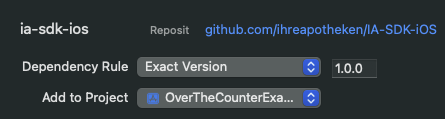
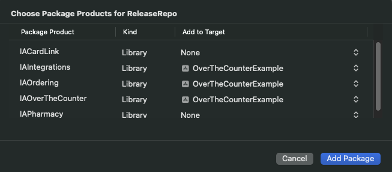

# Minimum requirements

*   iOS 15
    
*   SDK key
    

# API Key

In order to use IA SDK you will need API key with proper entitlements. Your API key is tied to your bundle ID(s).

@TODO where to get it.

# Installation

To add the IA SDK to your Xcode project, follow these steps:

1.  Open your Xcode `project` (or `workspace`), then go to **File > Add Package Dependencies**…
    
2.  Enter [https://github.com/ihreapotheken/IA-SDK-iOS](https://github.com/ihreapotheken/IA-SDK-iOS) into **Search or Enter Package URL** field.
    
3.  Specify a version and click **Add Package**. At this moment we recommend to specify **Exact Version**.  
    
    
4.  Now choose package products that you need, assign them to your target and click **Add Package**. In example below we are choosing `IAOverTheCounter` and `IAOrdering`. Note that your API key will need to include all products that you choose.  
    
    

# Initial setup and configuration

1.  First import your products, in this example we will be adding search and cart to our app, we need to import following products:
    

```swift
import IACore
import IAIntegrations
import IAOverTheCounter
import IAOrdering

```

2.  At starting point in your app you need to call IASDK.setup and pass your API key. Make sure that API key matches your bundle ID.
    

```swift
try await IASDK.setup(
    apiKey: "YOUR_API_KEY_HERE", 
    loadRemoteConfiguration: false
)

```

4.  Next, call the setup method for each product you plan to use. This is needed because, for example, calling `IAOrderingSDK.setup` makes the `Cart` feature (defined in `IAOrdering`) internally available to the `Search` feature (defined in `IAOverTheCounter`), allowing a cart button to appear on the search screen. You can call these right after your `IASDK.setup` call. Full code.
    

```swift
 try await IAOverTheCounterSDK.setup()
 try await IAOrderingSDK.setup()
```

# Prerequisites

Before using any features or displaying them on screen, make sure the following conditions are met. Call the following line of code once your UI is ready:

```swift
try await IAIntegrationsSDK.Prerequisites.runPrerequisites(isAnimated: false)

```

This will present a screen consisting of three steps:

*   **Legal Opt-In (mandatory):** The user must opt in to use the SDK.
    
*   **Onboarding (optional):** An introductory onboarding screen shown only once.
    
*   **Pharmacy (mandatory):** Most products require a pharmacy to be set. You can either:
    
    *   Manually provide a pharmacy identifier to the IA SDK, or
        
    *   If you’re using the IAPharmacy product, allow users to search for pharmacies via the **Pharmacy Finder** feature. You will have to call `IAPharmacySDK.setup()` in your SDK setup.
        

To skip certain steps, see [Prerequisites](./docs/prerequisites.md).

# Implementing features

Each feature has its own documentation:

# Example

```swift
import SwiftUI
import IACore
import IAIntegrations
import IAOverTheCounter
import IAOrdering

@main
struct OverTheCounterExampleApp: App {
    @State private var isLoaded = false
    
    var body: some Scene {
        WindowGroup {
            TabView {   
                if isLoaded {
                    MainProductSearchScreen()
                        .tabItem { Text("Search") }
                    
                    MainCartNavigationScreen()
                        .tabItem { Text("Cart") }
                }
            }
            .onFirstAppear {
                await setupSDK()
                await runPrerequisites()
                isLoaded = true
            }
        }
    }
}

extension OverTheCounterExampleApp {
    private func setupSDK() async {
        do {
            try await IASDK.setup(apiKey: "YOUR_API_KEY_HERE, loadRemoteConfiguration: false)
            try await IAOverTheCounterSDK.setup()
            try await IAOrderingSDK.setup()
        } catch {
            print(">>> Error \(error)")
        }
    }
    
    private func runPrerequisites() async {
        do {
            _ = try await IAIntegrationsSDK.Prerequisites.runPrerequisites(isAnimated: false)
        } catch {
            print(">>> Error \(error)")
        }
    }
}

```
